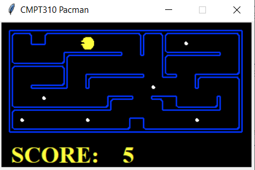

# Enhanced Pacman Game


This project is a customized version of the classic Pacman game. The primary objective is to navigate Pacman through a maze to collect all food pellets while ensuring that Pacman visits all four corners of the map. Unlike the original game, this version has **no ghosts**, allowing the focus to be on pathfinding and optimization.

## Features
- **No Ghosts**: Pacman can explore the maze without the threat of being chased.
- **Corner Visit Requirement**: Pacman must visit all four corners of the map at least once before completing the game.
- **Search Algorithms**: Three search algorithms are implemented to guide Pacman efficiently:
  - **Depth-First Search (DFS)**
  - **Uniform Cost Search (UCS)**
  - **A\* Search (A\*)**

## Instructions

### Prerequisites
- Python 3.x installed on your system.
- Ensure all required Python files (e.g., `pacman.py`, `SearchAgents.py`) are in the same directory.

### How to Run

#### Depth-First Search (DFS)
```bash
python -B pacman.py -l smallMaze -p DfsFoodSearchAgent -z 0.5
python -B pacman.py -l mediumMaze -p DfsFoodSearchAgent -z 0.5
python -B pacman.py -l bigMaze -p DfsFoodSearchAgent -z 0.5
```

#### Uniform Cost Search (UCS)
```bash
python -B pacman.py -l smallMaze -p UcsFoodSearchAgent -z 0.5
python -B pacman.py -l mediumMaze -p UcsFoodSearchAgent -z 0.5
python -B pacman.py -l bigMaze -p UcsFoodSearchAgent -z 0.5
```

#### A* Search
```bash
python -B pacman.py -l smallMaze -p AStarFoodSearchAgent -z 0.5
python -B pacman.py -l mediumMaze -p AStarFoodSearchAgent -z 0.5
python -B pacman.py -l bigMaze -p AStarFoodSearchAgent -z 0.5
```

### Map Layouts
- **smallMaze**: A compact maze for quick testing.
- **mediumMaze**: A moderately challenging maze.
- **bigMaze**: A large maze for testing complex algorithms.

### Zoom Control
- Use the `-z` flag to control the zoom level of the game interface. A smaller value increases zoom.

## Algorithms Overview

### Depth-First Search (DFS)
- Explores as far as possible along each branch before backtracking.
- Simple but not guaranteed to find the shortest path.

### Uniform Cost Search (UCS)
- Expands the node with the least cost first.
- Guarantees the shortest path to complete the game.

### A* Search (A\*)
- Combines UCS with a heuristic to prioritize nodes closer to the goal.
- Efficient and guarantees the shortest path.

### Example Output
```bash
Path found with total cost of 802 in 0.5 seconds
Search nodes expanded: 2092
```
